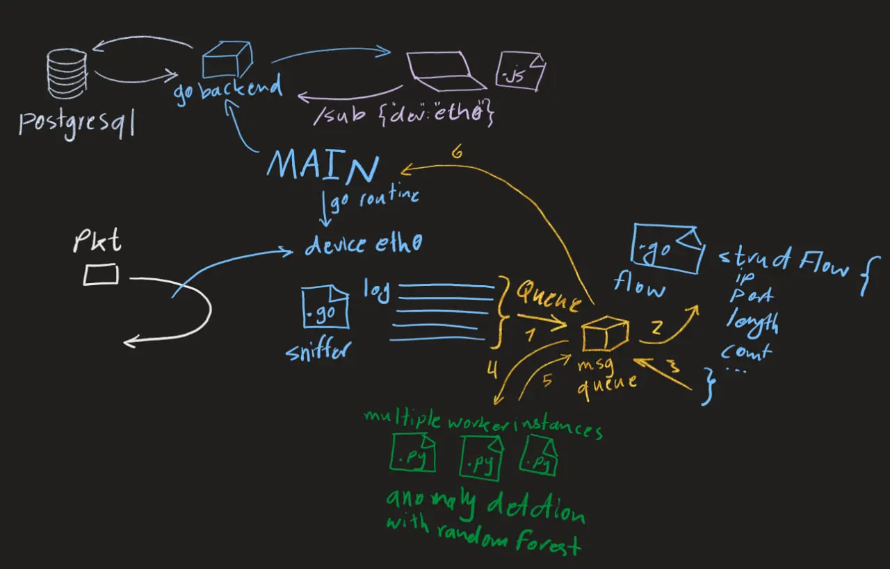

Today I focused on understanding some key concepts around building an Intrusion Detection System (IDS) and started thinking about the overall architecture for my project.

<!-- truncate -->

I learned how **packets, connections, and flows** relate to each other:

- A single TCP connection consists of many packets, and flows are essentially a grouping of these packets between two endpoints defined by a 5-tuple (src IP, src port, dst IP, dst port, protocol).
- UDP is different since it's connectionless — so flows have to be inferred based on timing and context rather than a formal handshake like TCP.
- QUIC adds complexity because it can migrate between different IPs and ports while still being the same logical connection.

---

I also explored what my IDS should analyze:

- At **Layer 4 (TCP/UDP)**, the IDS can detect suspicious flags like TCP scans or UDP spoofing.
- Higher up, at the **application layer**, protocols like HTTP or QUIC need extra context for feature extraction and anomaly detection.

---

Another important realization was how to structure the system:

- Sniffer → Feature Extractor → ML Analyzer → Backend → UI
- I want the sniffer to capture packets and publish them to a message queue (RabbitMQ).
- A separate service will aggregate them into flows and extract features for the ML model.
- The ML service will score each flow or request and feed results back to the backend.

A simple high-level architecture.

---

Finally, I started thinking about **data modeling**:

- Should each layer emit its own event, or should there be a single aggregated message per packet or flow?
- For now, I’m leaning toward aggregating data into a single structure per flow to keep things simpler but I might change my idea. I have to think deeper.

Overall, today was about **laying the groundwork** — no big code progress yet, but I feel like I’ve gained clarity on how to approach the problem and what challenges I’ll need to tackle next.

---

**Next Steps:**

- Design an initial architecture of system.
- Experiment with message passing using RabbitMQ.
